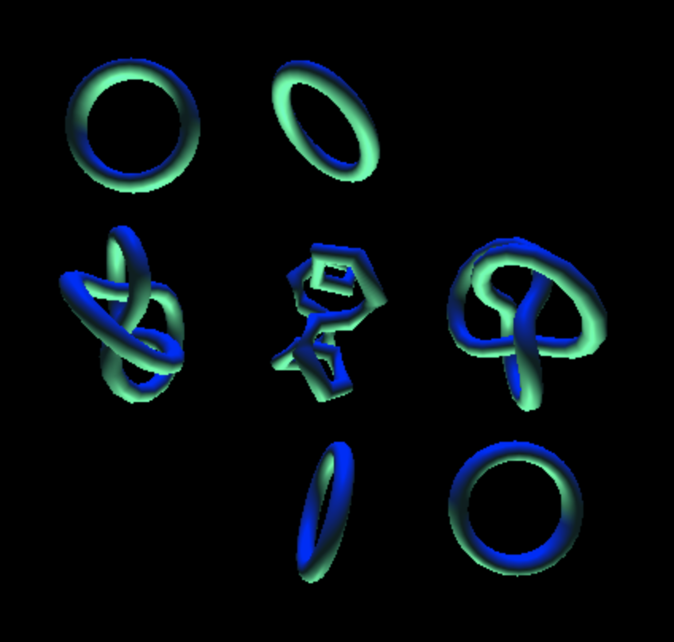

12-1-2020 Assignment
---

I modified [3_lights.html](https://ryoma.ms/CMPM35/Assignments/12-1-2020/3_lights.html) to:
- take up the full screen
- add an extra seafoam green (#00FA92) light at (0, -10, 0)
- replace all the original shapes, save for the (0, 2, 0) torus with:
    - 3 torus knots
    - 1 duplicate of the original torus
- add two extra toruses, both duplicates of the original torus provided.

[Click here to view a live demo.](https://ryoma.ms/CMPM35/Assignments/12-1-2020/3_lights.html)
 
 
>Original Assignment: _Turn in a link to a GitHub repo that modifies either the "shapes" or "lights" example from class, and include a screenshot of your project in the README for the repo._ 